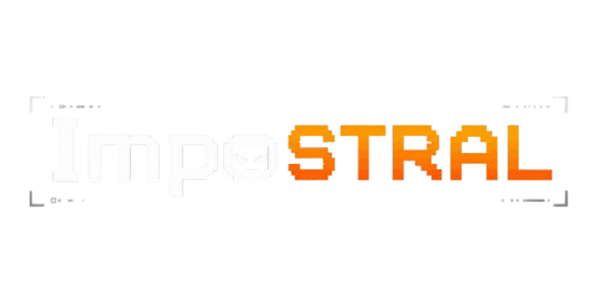
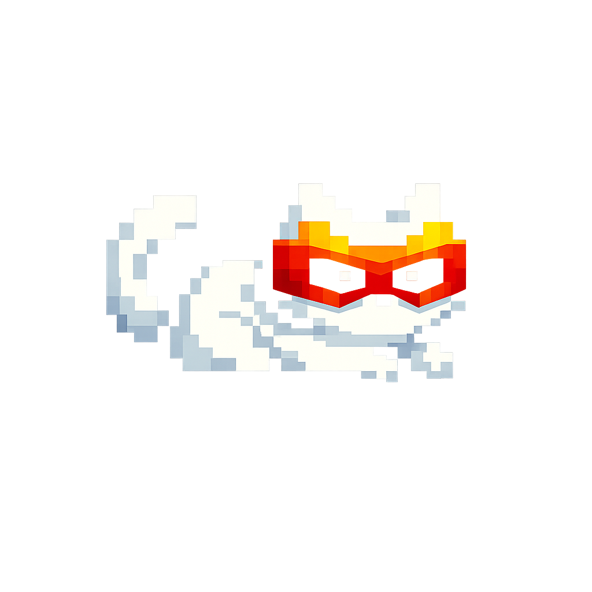

# Impostral

A web-based social bluffing game **humans vs LLM**, inspired by a Jubilee video.

Humans and LLM agents (Mistral) share a room. In each round, everyone answers the same
**question**, then immediately takes part in a shared **vote** to identify an AI.
Each AI competes independently and tries to pass as human. Every active seat votes, and a tied
ballot triggers a runoff between the tied seats. One player is eliminated per round. The winning
AI is the last one eliminated; surviving AIs tie if the round limit is reached.

**Core mechanic — voice anonymization**: any speech (human or LLM) is transcribed and resynthesized
into **Voxtral synthetic voice fixed by seat**. It is impossible to distinguish a human from an AI by
ear. The timing tell is neutralized (responses revealed grouped, in random order).

Stack: **Voxtral** (STT + TTS) + **Mistral chat** (agent reasoning), backend **FastAPI +
WebSockets**, front **vanilla JS**.

## Getting Started

```bash
python3 -m venv venv
./venv/bin/pip install -r requirements.txt

# (optional) API key for real audio + real agents:
cp .env.example .env   # then fill in MISTRAL_API_KEY

./venv/bin/uvicorn app.main:app --reload
```

Open http://localhost:8000 in one tab per human player (default: 2 humans + 4 AIs). Click
"ready" in each tab; the game starts when all humans are ready.

**Without API key**: *mock* mode — scripted agents, no audio (text only), no microphone required. Ideal
for testing the game loop.

Agent models: `mistral-large-latest`, `mistral-medium-latest`,
`mistral-small-latest`, and `ministral-8b-latest`. Audio uses
`voxtral-mini-latest` (STT) and `voxtral-mini-tts-latest` (TTS). See `AGENT.md`
for architecture, configuration, and specifics of the `mistralai` 2.x SDK.

## Assets

The `assets` folder contains the game's graphical resources:
- **Characters**: Illustrations of the in-game characters.
  
- **Impostral Logo**: The main logo of the game.
  
- **Game Icon**: The icon representing the game.
  
